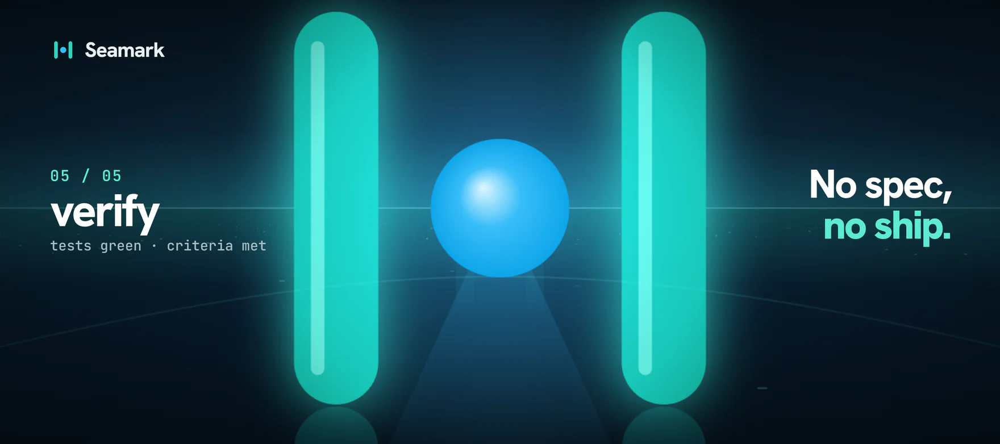
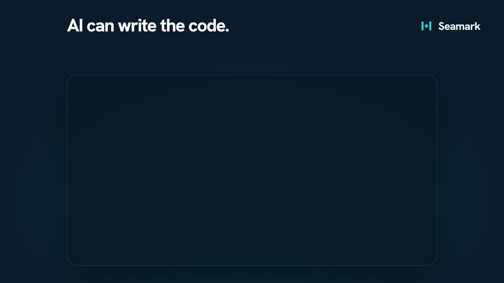
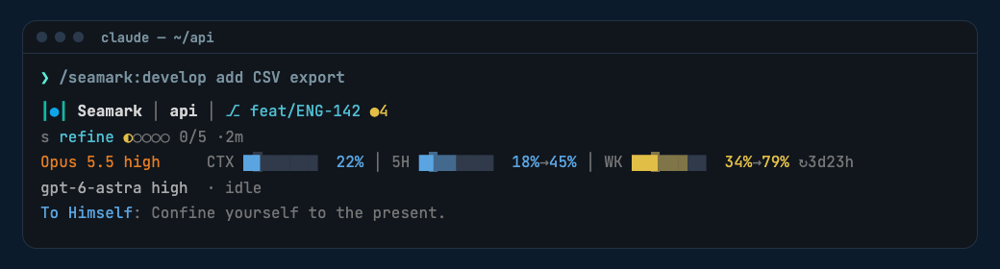

<div align="center">


# Seamark

### No spec, no ship.

**A gated delivery pipeline for [Claude Code](https://docs.claude.com/en/docs/claude-code).**

[](https://github.com/milaroid/seamark/actions/workflows/test.yml)


[Install](#install) · [How it works](#how-it-works) · [Commands](#all-commands) · [Statusline](#statusline)



</div>

---

## Why Seamark

AI can write the code. But it guesses what you meant.

<p align="center"></p>

Seamark puts gates between the request and the code. Every change goes through five phases in order: refine, plan, implement, review, and verify. A hook enforces the order, so the gates are not a suggestion to the model.

- **Enforce the plan.** A `PreToolUse` hook blocks edits outside `.seamark/` until the current phase has started through its skill. The model cannot jump from the request to the code.
- **Review independently.** Blind reviewers check the change in parallel, and a judge re-checks every serious finding. An optional second engine (Codex or Kimi) reviews too, and the stricter verdict wins.
- **Prove it's done.** A run passes only when the tests are green, no critical finding is open, and the spec's success criteria are met. When the loop limit is hit, the run ends as `BLOCKED`, never as `PASSED`.

The model writes the code. Seamark makes it prove it.

---

## Install

This repository is a Claude Code plugin marketplace. In Claude Code:

```text
/plugin marketplace add milaroid/seamark
/plugin install seamark@seamark
/reload-plugins
```

The commands, the five expert skills, and the phase hook load at once. Run `/plugin` and open **Installed** to confirm, and run `/hooks` to see the phase hook.

The engineering rules that the commands use ship in `rules/` and load through `${CLAUDE_PLUGIN_ROOT}`, so no host setup is necessary.

**Optional: the statusline.** The same marketplace has `seamark-status`, the cockpit for the pipeline:

```text
/plugin install seamark-status@seamark
/seamark-status:setup
```

See [Statusline](#statusline) for what it shows.

**Update.** Auto-update is off for third-party marketplaces, so Seamark does not update by itself. To get a new version, run these commands in your shell, then run `/reload-plugins` in an open session:

```sh
claude plugin marketplace update seamark
claude plugin update seamark@seamark
```

To update automatically, run `/plugin`, open the **Marketplaces** tab, select `seamark`, and select **Enable auto-update**. The [changelog](CHANGELOG.md) lists the changes in each version.

---

## Quick start

**Full pipeline, end to end** (the common case):

```text
/seamark:develop add per-IP rate limiting to the public API
```

Claude refines the request into a spec, plans it (the configured second engine checks the plan), implements the plan, reviews the diff, and runs a verify-fix loop. It stops to ask you only when a decision is yours to make.

**Or drive the phases yourself**, one command at a time:

```text
/seamark:refine add per-IP rate limiting to the public API
/seamark:plan
/seamark:implement
/seamark:review
/seamark:verify
```

**Or reach for a single tool:**

```text
/seamark:index          # first run in a repo — build the .seamark/ memory
/seamark:status         # where are we? what's left?
/seamark:cr             # security-review the current diff, evidence-only
/seamark:analyze the auth package's session handling
```

> **First time in a repo?** Run `/seamark:index` once. It scans the stack, patterns, and hotspots into `.seamark/`, which every later stage reads.

---

## The five-phase pipeline

Run together by `/seamark:develop`, or individually. Each is a real Skill with its own model tier.

| # | Command | What it does | Model |
|:-:|---------|--------------|:-----:|
| ① | `/seamark:refine` | Turns a raw request into a spec. It restates the goal, then asks bounded-menu questions until no decision is open. | Opus 5.5 |
| ② | `/seamark:plan` | Builds the implementation plan. When a second engine (Codex or Kimi) is set, it checks the plan too. Planning continues until no gap is open. | Sonnet 5.5 |
| ③ | `/seamark:implement` | Writes code **to the approved plan only**, in the repo's own patterns. A plan defect goes back to the plan stage. | Opus 5.5 |
| ④ | `/seamark:review` · `/seamark:review-fanout` | Reviews with `file:line` evidence. Small diffs get one sequential review. Large diffs get blind parallel lenses (security, architecture, tests, performance, migrations, observability, API contracts, compliance) and a judge. | Opus 5.5 |
| ⑤ | `/seamark:verify` | Runs a test-and-fix loop until the exit predicate holds: tests green, no critical finding, progress logged, and spec criteria met. The 3-loop cap ends as `BLOCKED`, never `PASSED`. | Sonnet 5.5 |

---

## All commands

**Pipeline** — the spine above, plus the orchestrator:

| Command | Purpose | Model |
|---------|---------|:-----:|
| `/seamark:develop` | Run all five phases end-to-end with hard phase gates and second-engine review. | Opus 5.5 |
| `/seamark:refine` · `/seamark:plan` · `/seamark:implement` · `/seamark:review` · `/seamark:review-fanout` · `/seamark:verify` | The phases, standalone (see table above). | Opus 5.5 / Sonnet 5.5 |
| `/seamark:readiness` | Release go/no-go from runtime, rollback, restore, alert, and capacity evidence. `/seamark:develop` runs it after verify for releases, data migrations, and runtime infrastructure changes. Reports only; never deploys. | Opus 5.5 |

**Support** — build, inspect, and learn from project memory:

| Command | Purpose | Model |
|---------|---------|:-----:|
| `/seamark:index` | Build or refresh persistent `.seamark/` project memory (stack, patterns, hotspots). | Opus 5.5 |
| `/seamark:status` | "Where are we" dashboard — focus, gaps, tasks, worktrees. Logs bugs and progress. | Sonnet 5.5 |
| `/seamark:research` | Isolated worktree research for unknowns before planning — advisory only. | Opus 5.5 |
| `/seamark:analyze` | Deep analysis of code/docs/systems, with optional diagrams and grading. | Fable 5.1 |
| `/seamark:setup` | Diagnose and configure the second engine — provider, model, effort, per-repo block. | Sonnet 5.5 |
| `/seamark:feedback` | Store explicit workflow preferences (filesystem only, no inference). | Haiku 4.5 |
| `/seamark:learn` | Turn stored feedback signals into per-skill behavioral adaptations. | Sonnet 5.5 |
| `/seamark:help` | Print the workflow reference — order, purposes, side-effect tiers. | Haiku 4.5 |

---

## Expert modes

Five specialist skills. Three **auto-activate** when matching files are edited; two are **invoked by hand**.

| Skill | Focus | Activation |
|-------|-------|------------|
| `seamark:go` | Senior Go engineering & review | Auto · `**/*.go`, `go.mod`, `go.work` |
| `seamark:react` | Senior React + TailwindCSS | Auto · `**/*.tsx`, `**/*.jsx`, `tailwind.config.*` |
| `seamark:biz` | Business-logic & domain mapping | Auto · `.business/**`, `**/BUSINESS.md` |
| `/seamark:cr` | Security review of changed code — evidence-only, read-only | Manual |
| `/seamark:security` | Standing-codebase OWASP/CWE audit + threat model | Manual |

---

## How it works

**Phase enforcement.** `/seamark:develop` writes marker files (`.seamark/DEVELOP_ACTIVE`, `.seamark/phase-<name>-started`/`-done`). The `enforce-develop-phase.py` `PreToolUse` hook denies `Edit`/`Write`/`MultiEdit` outside `.seamark/`, and any `Bash` command that writes outside `.seamark/` (output redirections, `tee`, in-place `sed`, `cp`/`mv`/`rm`/`touch`, working-tree `git` subcommands, inline interpreter writes), until the active phase has been entered through its skill. Auto mode steers Claude toward `sed` and heredoc edits instead of the file tools, which is why Bash is gated too. Writes inside `.seamark/` are always allowed, and read-only commands pass. This is what makes the gates real rather than advisory. Regression tests: `python3 hooks/test_enforce_develop_phase.py`.

**Second engine (opt-in, per repo).** Pick a provider via `.seamark/pipeline.yml` `second_engine.provider: codex | kimi | none` (default `none`; legacy `codex:` sections still work as a deprecated fallback). When a provider is selected it runs across the pipeline: `/seamark:plan` gets two blocking passes (Pass-1 architecture sanity, Pass-2 final-plan verdict), `/seamark:research` runs a parallel second researcher reconciled with Claude's, and `/seamark:review` / `/seamark:review-fanout` run it on every review with verdicts side-by-side. The stricter verdict always wins, and second-engine findings are leads to verify, never ground truth. Each run is **token-metered** against a budget (`token_budget`, default 200k) with graceful fallback to Claude-only. Schema and per-provider defaults: `references/pipeline-context.md`; protocols: `references/codex-protocol.md`, `references/kimi-protocol.md`. Configure interactively with `/seamark:setup`.

**Fan-out review.** `/seamark:review-fanout` spawns blind specialist subagents in parallel, and each one sees only its own lens. A judge pass then reconciles and deduplicates the findings at `file:line`. Lens prompts: `references/lens-templates.md`.

**Project memory (`.seamark/`).** Structured per-repo state every stage reads and writes:

| File | Holds |
|------|-------|
| `INDEX.md` | Repo identity, stack, patterns, hotspots |
| `TASKS.md` · `PROGRESS.md` · `GAPS.md` | Work tracking |
| `RESEARCH.md` | Appended research findings |

**Side-effect tiers.** Every change is classified before implement runs:

| Tier | Behavior |
|------|----------|
| `read-only` | Full pipeline, no confirmation |
| `write-local` | Proceed after the initial scope confirmation |
| `write-external` | Pause before implement and any destructive step — confirm explicitly |

---

## Optional dependencies

The pipeline **degrades gracefully** when these are absent:

- **Codex CLI** (`codex` ≥ 0.154.0 on `PATH`, the first release with `gpt-6-astra` in its model catalog; default model `gpt-6-astra`) — the `codex` provider for the second-engine passes across `/seamark:plan`, `/seamark:research`, and review, selected via `.seamark/pipeline.yml` `second_engine.provider: codex`. Token-metered per run with a budget + graceful fallback; optional fast mode.
- **Kimi Code CLI** (`kimi` ≥ 0.29.0 on `PATH`) — the `kimi` provider, selected via `second_engine.provider: kimi`. Same passes and metering; review runs over a diff the pipeline prepares. **Prerequisite:** `kimi -p` auto-approves every tool call and has no read-only mode, so the protocol gates its passes on user-level deny rules for `Write`/`Edit`/`Bash` in `~/.kimi-code/config.toml`. Without them, Kimi passes are skipped and the run continues Claude-only. `/seamark:setup` adds the rules with your confirmation; the details and what was tested are in `references/kimi-protocol.md` §6.1. Without either CLI — or with `provider: none` (the default) — every stage runs Claude-only.
- **`atlassian` MCP** — enables Jira enrichment when a request matches a Jira key and a per-project `.seamark/jira.yml` exists. Set up with:
  ```text
  claude mcp add --transport http --scope user atlassian https://mcp.atlassian.com/v1/mcp
  ```
  Without it, Jira steps are skipped.

---

## Layout

```text
seamark/
├── .claude-plugin/
│   ├── plugin.json
│   └── marketplace.json
├── assets/            # Seamark logo and README loops
├── commands/          # 16 slash commands (plugin name `seamark` → invoked as /seamark:refine, /seamark:plan, …)
├── skills/            # 5 expert-mode skills (/seamark:go, /seamark:react, /seamark:biz, /seamark:cr, /seamark:security)
├── references/        # codex-protocol · kimi-protocol · jira-context · lens-templates · pipeline-context · review-post-gate · checklists
├── rules/             # rigor · self-serve · verification · code-quality · testing  (referenced via ${CLAUDE_PLUGIN_ROOT})
├── hooks/
│   ├── hooks.json
│   ├── enforce-develop-phase.py
│   └── test_enforce_develop_phase.py
├── evals/             # fixtures, native eval cases, deterministic checks, and runner
└── README.md
```

## Evals

<details>
<summary>How to run the evals and read the results</summary>

Run fixture preflight, grader regression tests, and hook tests without model calls:

```sh
python3 evals/run.py --profile static
```

The runner needs Python 3.10+, Git, and Go. Paid profiles also need an authenticated
Claude CLI with `plugin eval` support. The model and judge defaults are recorded in
`evals/suite.json`; override them explicitly when comparing model configurations.

```sh
# One trial per selected case while developing a change.
python3 evals/run.py --profile targeted --case 'implement--happy' --max-cost-usd 5

# Three trials per case, including the documentation and execution groups.
python3 evals/run.py --profile regression --max-cost-usd 60

# Check semantic rubric labels before interpreting a new judge's scores.
python3 evals/run.py --calibrate --max-cost-usd 3

# Evaluate another plugin checkout against exactly the current suite.
python3 evals/run.py --profile regression --baseline /path/to/baseline-checkout --max-cost-usd 100

# Compare task quality with and without the plugin using a neutral request.
python3 evals/run.py --profile regression --case implement--neutral --ablation with-without --max-cost-usd 15

# Compare two compatible, completed reports.
python3 evals/run.py --compare /path/to/before/result.json /path/to/after/result.json

# Apply a checker fix to retained evidence without repeating model calls.
python3 evals/run.py --regrade /path/to/completed/result.json

# Buy fresh judge votes over complete evidence, without rerunning agents.
python3 evals/run.py --regrade /path/to/completed/result.json --rejudge --concurrency 2 --max-cost-usd 60

# Run each case on the model that its stage command pins, as the pipeline ships.
python3 evals/run.py --profile targeted --model pinned --runs 3 --case 'verify--*' --max-cost-usd 20

# Tune on the train split only. Score the held-out test split to accept a change.
python3 evals/run.py --profile regression --split train --max-cost-usd 40
python3 evals/run.py --profile regression --split test --max-cost-usd 20
```

`evals/split.json` assigns about one third of each stage's cases to `test`. The
seed is fixed and the assignment is random, not chosen by score. The agent under
test never sees the file. Keep a skill change only when the train and test pass
rates both rise. A `--baseline` run needs `--runs 3` or more. `--compare` reports
an overall `noise_floor` of about `1/sqrt(trials)`. Treat a smaller delta as noise.

The native judge reads truncated evidence. On 2026-09-29 it gave 4 false FAIL
verdicts in 15 trials. After a complete paid run, the runner rejudges every
semantic grader with three votes over the full saved trace. The rejudge uses the
budget that remains under `--max-cost-usd` and writes `<output>-rejudged/`. Use
the rejudged report as the result. A rejudge costs about $0.45 per trial, so set
the limit to cover the agent runs plus the rejudge. `--native-judge-only` skips
the rejudge; its semantic verdicts are then unconfirmed.

The cost limit is checked between native launches. Claude's native limit can
overshoot by the trials already in flight; concurrency defaults to one. Reports
stay local under the ignored `evals/results/` directory.

Each trial is `PASS`, `FAIL`, or `INVALID`. Missing fixtures, incomplete evidence,
authentication failures, and permission denials blocking required fixture access
or verification are invalid trials;
they prevent a successful suite result. A pass requires every deterministic check
and semantic grader to pass. Activation is a separate diagnostic and contributes
no points. Documentation, smoke, and execution results are reported separately.
Refused optional searches outside the workspace remain diagnostics when the agent
can complete the task. Documentation cases read reference files frozen with the
suite, so both plugin versions receive the same inputs.

The runner preserves complete traces and final workspaces, including workspaces
sealed by the native CLI. It only copies those artifacts; independent Go tests run
in a fresh copy without the retained Git configuration. Oracle tests remain outside
the evaluated plugin snapshot and are added after the agent stops. Phase checks
require observed skill calls and completion-marker writes; final marker files alone
do not establish phase order. These checks cover the prescribed marker protocol,
not arbitrary shell-program semantics.
The Go oracle requires passing test events for its named tests as well as exit 0,
so a `TestMain` that skips execution cannot pass. Offline regrading creates a new
report, keeps the original intact, and refuses changed prompts, fixtures, or oracle
inputs. It records the source report and incurs no additional model cost.
The controlled verification fixture's execution history counts repeated checks
inside one shell loop; the trace must still show the command being invoked.

The native CLI can shorten the evidence sent to semantic judges. Reports flag
this as `semantic_evidence_truncated`; inspect those votes before attributing a
failure to the plugin. `--rejudge` adds three fresh votes per LLM grader using every
visible message and tool result from the saved trace. It preserves judge reasons,
records the additional cost, and uses the original judge model. Its cost ceiling
is divided among the three votes in flight. Judge effort is pinned to `low` and
recorded with the replay code hash. Rejudge concurrency accepts one or two trials
(three or six simultaneous votes) and reserves each trial's share before launching.
Compare reports using the same judging
method; a native judgment and a complete-evidence judgment are not interchangeable.

Every report records models, CLI version, arguments, and hashes of plugin content,
fixtures, oracles, and graders. Comparisons reject incompatible or incomplete runs.
Use a fresh baseline after changing a fixture or grader. Keep the combined-input
oracle cases and safe-query variant out of prompt tuning. Calibration uses labeled
evidence summaries to audit rubric interpretation; it does not reproduce the native
grader's internal voting prompt, so inspect disagreements against complete traces.

Exit codes are `0` for pass, `1` for a behavioral failure, and `2` for invalid or
incomplete evaluation. The chat-only refinement regression may expose the command's
current persistence policy; retain that failure until the command behavior is fixed.

</details>

## Statusline

`seamark-status` shows the pipeline while it runs: the phase, the phase dots, the tasks, the verify loop, and the second engine's token burn. It also shows git and PR state and pace-aware bars for your 5-hour and weekly limits.

<p align="center"></p>

Install it from this marketplace with `/plugin install seamark-status@seamark`, then run `/seamark-status:setup`. The code and the full reference are in [milaroid/seamark-status](https://github.com/milaroid/seamark-status).

## License

MIT, see [LICENSE](LICENSE).

---

<div align="center">
<sub>Built for Claude Code. No spec, no ship.</sub>
</div>
